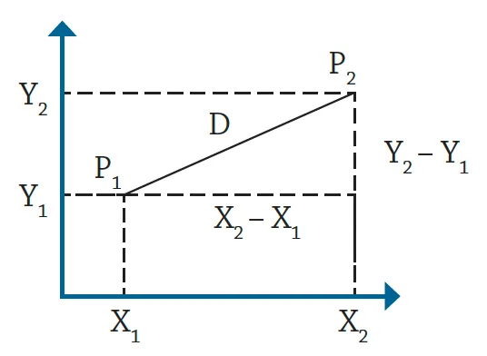
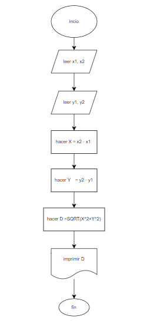
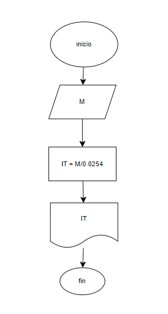
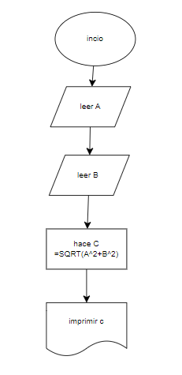
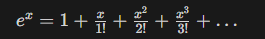
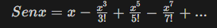

# Algoritmos

## 1.
Realice un diagrama de flujo y pseudocódigo
que representen el algoritmo para obtener la distancia entre
esos puntos.

Se requiere obtener la distancia entre dos puntos en el plano cartesiano,
tal y como se muestra en la figura 




Para este codigo hay que hallar las diferencias que hay entre las coordenadas porque el problema se puede ver como un triangulo rectangulo, con eso, se puede aplicar teorema de pitagoras y hallar a D.
```
inicio

leer x1, x2  
leer y1, y2  
hacer X = x2 - x1  
hacer Y = y2 - y1  
 hacer D =SQRT(X^2+Y^2)  
imprimir D  
fin  

<<<<<<< HEAD

=======
leer y1, y2

hacer X = x2 - x1

hacer Y = y2 - y1
 
hacer D =SQRT(X^2+Y^2)

imprimir D

fin
```



## 2.

Una modista, para realizar sus prendas de vestir, encarga las telas al extranjero. Para cada pedido, tiene que proporcionar las medidas de la tela en pulgadas, pero ella generalmente las tiene en metros. Realice un algoritmo
para ayudar a resolver el problema, determinando cuántas pulgadas debe pedir con base en los metros que requiere. Represéntelo mediante un diagrama de flujo y pseudocódigo (1 pulgada = 0.0254 m).

Para este ejemplo hay que hacer una conversion de unidades entre metros (M) y pulgadas (IT)
```
incio 

leer M

hacer IT = M/0.0254

imprimir IT

fin
<<<<<<< HEAD


```


## 3.

Se requiere determinar la hipotenusa de un triángulo rectángulo. ¿Cómo sería el diagrama de flujo y el pseudocódigo que representen el algoritmo para obtenerla? 
Recuerde que por Pitágoras se tiene que: $C^2 = A^2 + B^2$.

Aqui solo hay que representar el teorema de pitagoras, haciendo que lea las variables y haciendo la operacion ___C^2 = A^2 + B^2___
```
inicio

leer A

leer B

hacer C=SQRT(A^2+B^2)

imprimir C

fin

```



## 4.

Se requiere determinar la edad actual de una persona basándose en su fecha de nacimiento. Además, es necesario establecer si la persona ya ha cumplido años en el año en curso, si aún no lo ha hecho, o si hoy es su cumpleaños, para celebrarlo. La fecha de nacimiento y la fecha actual estarán representadas mediante tres variables: día, mes y año.
    
  Instrucciones:
    
  - Diseñe un algoritmo que permita calcular la edad de la persona.
  - Dentro de la solución, determine si la persona ya celebró su cumpleaños este año o si aún no lo ha hecho.
  - Verifique si la fecha actual corresponde al día de su cumpleaños. De ser así, imprima el mensaje “Feliz Cumpleaños”.
  - Represente la solución utilizando **pseudocódigo** claro y estructurado.

para este pseudocodigo se tienen que escribir las condiciones para que haga un cambio en las variables, si hay algo que año = año y no cambia, se puede descartar y no escribirse porue no va a afectar el codigo, cada vez que las variables de año y mes y dia actuales sean mayores que dia, mes y año, se reduce la edad a un año
```
inicio

leer día, mes, año

leer día_actual, mes_actual, año_actual

edad = año_actual - año

  si mes_actual > mes

  hacer edad = edad -1

  si mes_actual = mes

     si no dia_actual dia

         edad = edad -1

     si no dia_actual = dia

     escribir "feliz cumpleaños"

     fin si no

  fin si no

escribir edad

fin
```
## 5.

Realice un algoritmo que permita determinar el sueldo semanal de un trabajador con base en las horas trabajadas y el pago por hora, considerando que a partir de la hora número 41 y hasta la 45, cada hora se le paga el doble, de la hora 46 a la 50, el triple, y que trabajar
más de 50 horas no está permitido. Represente el algoritmo mediante pseudocódigo.

en el ejercicio hay tres condiciones, se escriben los tres y se escribe lo que la condicion me indica
```
Inicio

Leer horas trabajadas

Sueldo = horas_trabajadas * pago_por_hora

 Si 41 <= horas_trabajadas <= 45

     Sueldo = 2*sueldo

 Si 46 <= horas_trabajadas <= 50

     Sueldo = sueldo *3

 Si horas_trabajadas > 50

Escribir "no está permitido"

Fin si

Escribir sueldo

Fin
```
## 6.

Se requiere un algoritmo para determinar, de N cantidades, cuántas son cero, cuántas son menores a cero, y cuántas son mayores a cero. Realice el pseudocódigo para representarlo, utilizando el ciclo apropiado.
```
Inicio

Leer el valor de N

mientras i <= N:

   Leer el valor de cantidad
   
   Si cantidad = 0
      
    contador_cero = contador_cero + 1
   
   Si cantidad < 0
      
    contador_menor_cero = contador_menor_cero + 1
   
   Si cantidad > 0
      
    contador_mayor_cero = contador_mayor_cero + 1
      
    i = i + 1

imprimir

   - "Cantidades iguales a cero: ", contador_cero

   - "Cantidades menores a cero: ", contador_menor_cero

   - "Cantidades mayores a cero: ", contador_mayor_cero

Fin
```
## 7.

Se requiere un algoritmo para determinar cuánto ahorrará en pesos una persona diariamente, y en un año, si ahorra 3¢ el primero de enero, 9¢ el dos de enero, 27¢ el 3 de enero y así sucesivamente todo el año. Represente la solución mediante pseudocódigo.
```
inicio

días = 1 

ahorro_diario = 3

ahorro_total = 0

mientras días <= 365

  ahorro_diario = 3(3^(dias-1))/100

  escribir ahorro_diario

  ahorro_total = ahorro_total + ahorro_diario

  días = días + 1

fin mientras 
escribir ahorro_total
fin
```
## 8.

Realice el algoritmo para determinar cuánto pagará una persona que adquiere N artículos, los cuales están de promoción. Considere que si su precio es mayor o igual a $200 se le aplica un descuento de 15%, y si su precio es mayor a $100, pero menor a $200, el descuento es de
12%; de lo contrario, solo se le aplica 10%. Se debe saber cuál es el costo y el descuento que tendrá cada uno de los artículos y finalmente cuánto se pagará por todos los artículos obtenidos. Represente la solución mediante pseudocódigo.
```
Inicio

Leer N

total = 0

contador = 1

Mientras contador <= N

 Leer precio

 si precio >= 200

      descuento = precio * 0.15

 si no precio > 100

     descuento precio * 0.12

 si no

     descuento precio *0.10

Fin si

precio = precio - descuento

total = total + precio

contador = contador + 1

Escribir precio, descuento

Fin Mientras

Escribir total

Fin
```
## 9.

Realice un algoritmo y represéntelo mediante pseudocódigo para obtener una función exponencial, la cual está dada por:


```
Inicio

Leer x

Leer n 

Repetir mientras i < n

   Si i = 0

     termino = 1

   Si no

   
     factorial = factorial * i
   
     termino = (x^i) / factorial
   
   suma = suma + termino
   
     i = i + 1

Mostrar el valor de suma como el resultado de e^x

Fin
```
## 10.

Realice un algoritmo para obtener el seno de un ángulo y represéntelo mediante pseudocódigo. Utilice la siguiente ecuación:

````
mientras i desde 1 hasta n hacer:

    factorial = 1

    Para j desde 1 hasta (2*i - 1) hacer

        factorial = factorial * j 

    Fin mientras

    termino = (x^(2*i - 1)) / factorial

    resultado = resultado + (signo * termino)  

    signo = -signo  

Fin mientras

escribir ≈ sin(x)

Fin  


